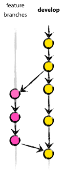
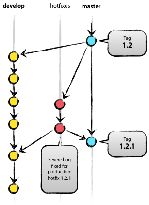

# 玩转git命令行  
## git基础篇  
- workspace:    工作区  
- Index/Stage: 暂存区  
- Repository:  仓库区/本地仓库  
- Remote:  远程仓库  
## git命令篇
**配置命令 config**
1.说明：用于配置本机的git的相关属性   
2.语法：git config [选项] 属性名 属性值  
3.选项：--global 表示你这台机器上所有的Git仓库都会使用这个配置，当然也可以对某个仓库指定不同的用户名和Email地址  
--list:查看所有配置信息  
4.示例：
>  $git config --global user.name "your name"
 >   $git config --global user.name "your emal"

**cd命令** 
1.说明：转换当前目录  
2.语法：cd 目录名（包括相对目录和绝对目录）  
3.示例：`cd/d/repository `      (意思是转换到d盘repository目录下进行操作)  

**mkdir命令**  
1.说明：创建目录  
2.语法：无  
3.示例：mkdir  mygit            （意思是在文件夹下创建一个子文件夹）  

**pwd命令**  
1.说明：显示当前目录    

**init命令**  
1.说明：初始化当前目录，将当前目录变成git可以管理的仓库  
2.语法：`git init`    

**add命令**  
1.说明：提交所有的修改放到暂缓区  
2.语法：git add [文件名]   
3.示例：git add readme.txt  

**commit命令**  
1.说明：把暂存区的所有修改提交到分支  
2.语法：git commit [选项]  
3.选项：   
-m: 表示为本次添加说明  
-a:相当于直接执行，即先执行add命令再执行commit    
4.示例：`git commit -m "add readme file"  `   

**status命令**  
1.说明：查看修改的文件状态  
2.语法：git status  

**diff命令**  
1.说明：比较文件修改的内容
2.语法：git diff [文件名]
3.示例：`git diff  readme.txt`  

**log命令**  
1.说明：查看历史纪录  
2.语法：git log  
3.选项： --pretty=oneline 显示commit_id(长)+提交时的说明  
--graph  显示分支信息  
--abbrev-commit  显示commit_id+提交说明  
-num  表示数字，查看最近提交    
4.示例：  

>##查看日志  
>git log   
>##查看日志，显示commit_id content  
>git log --pretty=oneline  
>##查看日志，显示commit_id content，并显示分支提交信息  
>git log --graph --pretty=oneline --abbrev-commit  
>##查看最近一次提交  
>git log --graph --pretty=oneline --abbrev-commit -1  
>##查看日志用这个就够了  
>git log --color --graph --pretty=format:'%Cred%h%Creset -%C(yellow)%d%Creset %s %Cgreen(%cr) %C(bold >blue)<%an>%Creset' --abbrev-commit     

**reset版本回退命令**  
1.说明：将文件的版本回退到以前的版本  
2.语法：git reset [选项] [HEAD^ (^表示上个版本，^^表示上上个版本，以此类推)or HEAN~（1-100）]  
3.选项： --hard  
4.示例：
> git   reset  --hard   HEAD^^    #回退到上上个版本  
   > git reset  HEAD   file      #把暂存区的file的修改撤销掉，重新放回工作区  

**reflog命令**  
1.说明：显示历史命令  
2.示例：git   reflog  

**cherry-pick命令**  
1.说明：整理提交记录（知道所需要的提交记录且知道这些记录的哈希值）  
2.语法：git  cherry-pick <提交号>  

**rebase重新排序命令**  
1.说明：在不知道你想要的提交记录的哈希值时找到你想要的记录  
2.语法： git  rebase -i HEAD~num(会出现编辑界面)  
3.参数：-i  

**checkout命令**   
1.说明：用版本库里的版本替换工作区的版本，无论工作区是修改还是删除，都可以“一键还原”  
     从版本库中检出文件或切换分支     
2.语法：git checkout  [选项]  （file or 分支名称） （远程分支名称）    
 3.选项：  
--  #不切换到另一分支  
 -b  #创建并切换分支  
4.示例：
>##从版本库中检出文件覆盖到工作区  
>git checkout --    git常用命令.enmd  
>##从主分支中创建并切换分支  
>git checkout -b dev  
>##从主分支中创建并切换分支，同时关联到远程仓库origin的dev分支  
>git checkout -b dev origin/dev  
>##切换到master分支  
>git checkout master  

**branch命令**    
1.说明：分支管理  
2.语法：git branch  [分支名称]  
3.选项：  
-a：查看本地及远程仓库中的分支  
-d：删除分支  
-D：强行删除分支  
--set-upstream-to=origin/dev：将远程仓库的分支与本地仓库的分支管理  
4.示例：  
>##创建dev分支  
>git branch dev  
>##将本地的dev分支与远程仓库origin的dev分支关联  
>git branch --set-upstream-to=origin/dev dev  
>##列出所有分支，当前分支前面会标一个*号  
>git branch    

**merge命令**  
1.说明：分支合并  
2.语法：git  merge [分支名称]  
3.选项： --no-ff:  禁用Fast forward   
-m:  在禁用fast forward  
4.示例：git merge  dev   

**stash命令**   
1.说明：暂存当前工作现场  
2.语法：git stash [子命令]  
3.子命令：  
list：查看存储的工作现场  
apply [stash_id]：恢复工作现场，但是恢复后，stash内容并不删除  
drop [stash_id]：删除已存储的工作现场   
pop [stash_id]：恢复工作现场，并删除stash  
4.示例：  
>##保存当前工作现场  
>git stash  
>##查看已保存的工作现场    
>git stash list    
>##恢复现场（单个现场是使用）  
>git stash apply  
  >##恢复指定的现场 
>git stash apply stash@{0}  
>##删除保存的现场  
>git stash drop  
>##删除已保存的指定的现场  
>git stash drop stash@{0}  
>##恢复现场并从暂存空间删除  
>git stash pop  
>##恢复指定的现场并从暂存空间删除  
>git stash pop stash@{0}  

**rm删除命令**  
1.说明：将文件从版本库中移除，移除后要commit    
2.语法：git  rm  test.txt    

**remote命令**  
1.说明：查看远程仓库   
2.语法：git remote [远程仓库的别名] [远程仓库的url]   
3.选项：-v   #显示更详细的信息（抓取和推送的url）   
4.子命令：add  #添加远程仓库（即关联本地仓库和远程仓库）需要在本地仓库的主目录中执行该命令   
5.示例：  
>##通过ssh方式添加远程仓库   
>git remote add origin   https://github.com/frainmeng/learn.git  
  >##查看远程仓库   
>git remote -v   

**push命令**     
1.说明：把本地库的内容推送到远程  
2.语法：git  push [远程仓库名]  [本地仓库名 or 标签名]  
3.选项：-u：  初次推送使用，Git不但会把本地的master分支内容推送的远程新的master分支，还会把本地的master分>支和远程的master分支关联起来，在以后的推送或者拉取时就可以简化命令  
4.示例：  
>##初次推送master分支到远程仓库   
>git push -u origin master     
>##将dev分支推送至远程仓库    
>git push origin dev  
>##将本地标签推送至远程仓库  
>git push origin v1.0  
>##将本地所有标签推送至远程仓库  
>git push origin --tags  
> ##将远程仓库中的标签删除  
>git push origin :refs/tags/v1.0    

**clone命令**  
1.说明：从远程仓库克隆到本地仓库    
2.语法：git  clone  远程仓库url    
3.示例：git clone git@github.com:frainmeng/learn.git    

**tag标签**    
1.说明：标签操作   
2.语法：git  tag [tagname  or   commit_id]   
3.选项：  
-a：配合-m使用，附加说明信息  
-m：配合-a使用，附加说明信息   
-d：删除标签    
-s：用私钥签名一个标签  

4.示例：  
>##创建标签  
>git tag v1.0  
>##在指定的（提交）位置创建标签  
>git tag v0.9 67833a4  
>##查看所有标签  
>git tag  
>##为标签附加说明西悉尼  
>git tag -a v0.9 -m "说明信息"67833a4  
>##删除标签  
>git tag -d v0.9  

**show命令**  
1.说明：显示标签的详细信息  
2.示例：git  show  v1.0    #查看标签的详细信息  

**Git Tag标签管理**  
标签的创建、删除   
git tag t1，从当前分支创建一个名为t1的标签    
git tag -d t1，删除名为t1的标签   
## git技巧篇

1.如何修改远程仓库地址    
- 修改命令：`git remote set-url origin [url]`
- 先删后加： `git remote rm origin `      `git remote add origin [url]`  
- 直接修改config文件 ` git config -e [--global]

2.如何提交文件夹到github远程仓库  
- $ git add floder_name/`*.*`       
- $ git add floder_name/*  

3.如何撤销一个合并   
- $ git merge  --abort  

4. 查看图片的差别       
[图片差别](https://github.com/blog/817-behold-image-view-modes)

5.删除本地分支使用：
> $ git branch -d branch_name

注意：该-d选项是一个别名--delete，只有当分支已经在其上游分支中完全合并时，它才会删除该分支。你也可以使用-D这个别名来--delete --force删除分支“不管合并状态”。     
删除远程分支   
从Git v1.7.0开始，可以使用远程分支删除  
> $ git push origin --delete <branch_name>  

5.GitLib权限管理  
GitLib有五种身份权限，分别是：  
  ● Owner 项目所有者，拥有所有的操作权限  
  ● Master 项目的管理者，除更改、删除项目元信息外其它操作均可  
  ● Developer 项目的开发人员，做一些开发工作，对受保护内容无权限  
  ● Reporter 项目的报告者，只有项目的读权限，可以创建代码片断  
  ● Guest 项目的游客，只能提交问题和评论内容    
 
6.命名规则
   ● 每次提交必须写明注释，如果是修复Bug，请加上Bug号  
   ● 创建特性分支，名称要以f-开头，加上特性名  
  ● 创建发布分支，名称要以r-开头，加上预发布版本号  
  ● 创建Bug修复分支，名称要以b-开头，加上Bug号  
  ● 创建标签，名称要以t-开头，加上发布版本号  
  ● 合并分支时必须使用--no-ff参数，以保留合并历史轨迹  

7.特性分支  
从develop分支创建，用于特性开发，完成后要合并回develop分支。   
操作过程：   
git checkout -b newfeature develop，从develop分支创建newfeature特性分支   
git checkout develop，开发完成后，需要合并回develop分支，先切换到develop分 支  
 git merge --no-ff newfeature，合并回develop分支，必须加--no-ff参数 
git branch -d newfeature，删除特性分支   
git push origin develop，把合并后的develop分支推送到远程仓库     
分支关系类似下图:     
  
8.发布分支  
从develop分支创建，用于预发布版本，允许小bug修复，完成后要合并回develop和master。   
操作过程： 
git checkou -b release-1.2 develop，创建一个发布分支   
git checkout master，切换到master分支，准备合并   
git merge --no-ff release-1.2，把release-1.2分支合并到master分支   
git tag 1.2，从master分支打一个标签   
git checkou develop，切换到develop分支，准备合并   
git merge --no-ff release-1.2，把release-1.2分支合并到develop分支   
git branch -d release-1.2，删除这个发布分支 
 
9.修复分支  
从master分支创建，用于生产环境上的Bug修复，完成后要合并回develop和master。   
操作过程：   
git checkout -b hotfix-1.2.1 master，从master分支创建一个Bug修复分支   
git checkout master，切换到master分支，准备合并   
git merge --no-ff hotfix-1.2.1，合并到master分支   
git tag 1.2.1，为master分支创建一个标签   
 git checkout develop，切换到develop分支，准备合并   
git merge --no-ff hotfix-1.2.1，合并到develop分支   
git branch -d hotfix-1.2.1，删除hotfix-1.2.1分支   
分支关系类似下图:   
  

