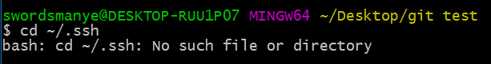

# SSH key 的创建  
## 关于SSH  
SSH协议，可以连接和验证远程服务器和服务。使用SSH密钥，可以连接到GitHub，而无需在每次访问时提供用户名或密码。
## 命令行：
1. 在Git bash内执行：
```
cd ~/.ssh
```  
如果返回`No such file or directory`那就说明没有生成过SSH key



2.如果没有出现上面的情况说明你之前已经生成过SSH key, 输入`ls -al ~/.ssh`查看现有的密钥是否存在
   
默认情况下，公钥的文件名是id_rsa.pub，看看你自己是否有。


3.生成新的SSH key：（引号内的邮箱替换成你们自己的邮箱）。  
```
ssh-keygen  -t   rsa   -C  "swordsmanye@gmail.com"
```   
运行后的结果:  
```
$ ssh-keygen -t rsa -C "swordsmanye@gmail.com"
Generating public/private rsa key pair.  
Enter file in which to save the key 
(/Users/your_user_directory/.ssh/id_rsa):    按回车键  
Enter passphrase  (empty for no passphrase):   输入密码，自己容易记住的   
Enter same passphrase again:   再次输入密码    
```  

4.输入`~/.ssh`就能看到生成的文件所在的地方，在文件目录下会得到 `id_rsa`和 `id_rsa.pub`两个文件，`id_rsa.pub`文件里存放的就是我们要使用的key.  

5.上传key到github:    
 > 1.ctrl+A全选，复制key到剪贴板  
 > 2.登录到[github](https://github.com)  
 > 3.点击右上方的头像，选择settings  
 > 4.选择SSH key选项  
 > 5.点击Add SSH key,把剪贴板的内容复制到里面，确定即可  
 
6.测试是否配置成功  
```
ssh -T git@github.com
```

配置成功标志  
```
Hi username!You've successfully authenticated,but Gitub does not provide shell access 
```


### 参考资料  

- [一个可以量身定制你头像的网站](http://cn.gravatar.com/)    
- [Github官方手册](https://help.github.com/articles/generating-ssh-keys)  
- [更多问题请点击这里](http://riny.net/2014/git-ssh-key/)  
-  [Git如何在本地生成多个SSH key](https://yanyinhong.github.io/2017/05/01/How-to-generate-multi-ssh-keys/)    


