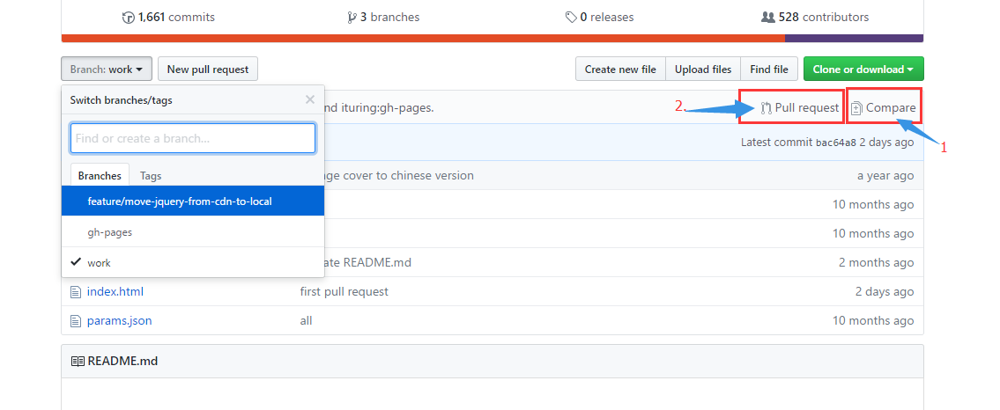

##  如何进行Pull Request  

###  什么是pull request 
pull request是自己修改源代码后，请求对方仓库采纳该修改时采取的一种行为。  
###  pull request 的流程  
现在假设我们在使用Github上的一款开源软件。在使用这款软件的过程中，我们偶然间发现了bug，为了继续使用软件，我们手动修复了这个bug。如果我们修改的这段代码能被该软件的开发仓库采纳，今后与我们同样使用这款软件的人就不会再遇到这个bug了。为此我们要第一时间发送pull request    
在github上发送pull request 后，接收方的仓库会创建一个附带源代码的issue,我们在这个issue中记录详细内容，这就是pull request。  
发送过去的pull request时候被采纳，要由接收方仓库的管理者进行判断，一般只要代码没有问题，对方都会采纳，不过发送pull request之前要详细阅读contribution guide。  
### 发送pull request 的步骤：  
1. **Fork**
找到自己心仪的项目，点击fork按钮把项目fork到自己仓库目录下。假设自己github上fork后的仓库名为	`swordsmanye/first-PR`

2. **clone**
在本地目录下创建一个仓库，然后将fork后的仓库clone到本地仓库。  
>  `git  clone url地址`   
>  `cd first-PR`  

first-PR目录下会生成Git仓库。这个仓库与我们Github账户下的first-PR仓库状态相同。现在只要在这个仓库中修改源代码进行push，Github账户中的仓库就会被修改。    

3.**branch**

-  .......为何要在特性分支中进行作业    
当前Git的主流开发模式都会使用特性分支。在github上发送pull request时，一般都是发送特性分支。这样子的话，pull request 就拥有更明确的特性（主题）。让对方了解自己修改代码的意图，有助于提高代码审查的效率。  
- .......确认分支   
先查看一下clone出来的仓库分支  

> `git branch -a`  
出现的结果中，开头加了`remote/origin/`的是Github端仓库的分支。  

- ......创建特性分支   
假设我们创建一个名为work的分支，用来发送pull request。这个work分支就是这次的特性分支。现在创建work分支并自动切换。  

> `git checkout -b work `  
> 确认是否切换到work分支下  
> `git branch -a `  
> 查看当前文件列表  
> `ls -al`  

然后就可以自由修改代码了，发挥自己的能力，贡献自己的代码。  

4.**创建远程分支**  
要从github发送pull request，Github端的仓库中必须要有一个包含了修改后代码的分支。我们现在创建本地work分支的相应远程分支。  

> `git push origin work`  
> 查看分支，origin/work已经被创建
> `git  branch -a `  

打开Github,确认work分支是否被创建，以及是否包含我们添加的代码。 

5.**发送pull request**  
@  

- 切换到work分支   
- 图片中1选项可以查看分支之间的差别  
-  确认无误后可以点击选项2，开始拉请求     

注： 为了防止开发到一半的pull request被误合并，一般会在标题前面加上【WIP】WIP是work in progress的简写，表示仍然在开发过程中，等所有功能都实现之后，在消除这个前缀  

参考资料：   
[创建Pull Request]()    
[如何在github上递交高质量的pull request](http://www.jianshu.com/p/47f8c85a0925)    
[github同步fork别人的项目到自己的仓库](https://segmentfault.com/a/1190000003703918)      
[官方参考文档](https://help.github.com/search/?utf8=%E2%9C%93&q=pull+request)   